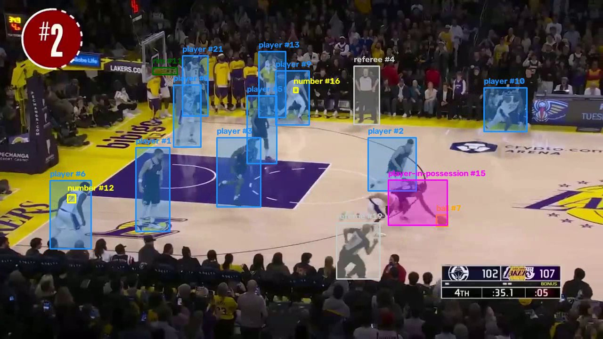

# Automated basketball game statistics with computer vision

Detects players, referees, the ball, jersey numbers and some game events in NBA broadcast video,
tracks them across frames and draws the result. Unfinished: started in December 2025, picked back
up in September 2026.



## What it does

The pipeline reads a clip, runs an object detector on every frame, links the detections into
tracks and writes an annotated video.

- Detection: **RF-DETR Medium**, fine-tuned on a Roboflow basketball dataset (30 epochs, batch 5,
  resolution 576, seed 42, trained on a Colab GPU).
- Tracking: **ByteTrack** from the `supervision` library, which gives each object an id that
  carries across frames.
- Detections are cached to a pickle file, so redrawing does not re-run the model.

The model has ten classes: `ball`, `ball-in-basket`, `number`, `player`, `player-in-possession`,
`player-jump-shot`, `player-layup-dunk`, `player-shot-block`, `referee` and `rim`. Five of them
are events rather than objects.

## Results

Evaluated on the **94-image test split** with `supervision`'s `MeanAveragePrecision`. Predictions
use `threshold=0`, because mAP needs every detection ranked by confidence. The numbers come from
`scripts/eval_per_class.py`, run on an RTX 5070 in September 2026. IoU is how much a predicted box
overlaps the true one.

| Metric | Value |
|---|---|
| mAP @[IoU 0.50:0.95] | **0.561** |
| mAP @IoU 0.50 | 0.802 |
| mAP @IoU 0.75 | 0.630 |
| AP, small objects | 0.419 |
| AP, medium objects | 0.434 |
| AP, large objects | 0.683 |

The December 2025 notebook (`notebooks/train_and_evaluate.ipynb`) reported 0.557 overall on the
Colab checkpoint. The overall number agrees within 0.004, and a CPU run of the script gives exactly
0.557. The size buckets differ by up to 0.03, large objects the most (0.654 then, 0.683 now). The
likely reason is that the weights file used here is a different checkpoint from the same training
run. The table shows what these weights produce.

### Per class

| Class | AP @[.50:.95] | AP @.50 | Test boxes |
|---|---|---|---|
| referee | 0.793 | 0.984 | 280 |
| player | 0.793 | 0.983 | 896 |
| player-shot-block | 0.689 | 0.857 | 14 (noisy) |
| player-jump-shot | 0.582 | 0.769 | 16 (noisy) |
| rim | 0.567 | 0.973 | 93 |
| player-in-possession | 0.520 | 0.619 | 18 (noisy) |
| ball | 0.430 | 0.816 | 88 |
| number | 0.394 | 0.823 | 567 |
| ball-in-basket | 0.285 | 0.393 | 8 (very noisy) |
| player-layup-dunk | not scored | n/a | 0 |

Players and referees are detected well. The **ball and jersey numbers** are the weak classes: both
are around 0.4 AP overall but above 0.8 at IoU 0.50, so the model usually finds them but draws
loose boxes. Box score statistics would need exactly these two, so the statistics part of the
project does not work yet.

Classes with fewer than 20 test boxes are noisy. `ball-in-basket` moved by 0.03 between a CPU and a
GPU run of the same weights. `player-layup-dunk` has no test boxes, so the overall mAP is an
average over nine classes.

## Limitations

- The test split comes from the same games and clips as the training data. It measures fit, not
  how well the model does on a new broadcast.
- Tracking is not evaluated. There is no ID-switch count.
- The whole clip is loaded into memory, so only short clips work. A minute of 1080p takes about
  11 GB.

## Running it

Install PyTorch for your machine first ([pytorch.org](https://pytorch.org/get-started/locally/)),
then:

```
pip install -r requirements.txt
python main.py --input input_video/nba.mp4 --output output/result.avi
```

| Flag | Default | |
|---|---|---|
| `--input` | `input_video/nba.mp4` | input clip |
| `--output` | `output/result.avi` | annotated video, written at the input's frame rate |
| `--weights` | `BASKETBALL_CV_WEIGHTS`, else `models/object_detection.pth` | model weights |
| `--stub` | `stubs/object_track_stubs.pkl` | cache of tracked detections |
| `--fresh` | off | ignore the cache and re-run detection |

To reproduce the evaluation, with the dataset extracted under `notebooks/`:

```
python scripts/eval_per_class.py --weights models/object_detection.pth
```

The weights, dataset, input video and output are **not in the repository** (see `.gitignore`).

- Dataset: [`basketball-player-detection-3`](https://universe.roboflow.com/roboflow-jvuqo/basketball-player-detection-3-ycjdo)
  version 10 from Roboflow Universe, COCO format.
- Weights: not published. Retrain with `notebooks/train_and_evaluate.ipynb`.
- Input: NBA broadcast clips.

## Future work (not started)

None of this is built. Each step can be checked against data the NBA publishes, box scores and
shot charts:

1. Cut and replay detection, so replayed baskets are not counted twice.
2. Final score from `ball-in-basket` events, compared with the official score.
3. Shot chart via court homography (mapping the video frame to court coordinates), compared with
   the NBA's shot chart.
4. Points per player, which needs jersey number recognition and team assignment, compared with the
   box score.

Smaller items: a test on footage from a game that is not in the dataset, an ID-switch count for the
tracker, and reading frames as a stream instead of loading the whole clip.

## Layout

```
main.py                                       pipeline entry point
trackers/object_tracker.py                    detection and ByteTrack, with stub caching
drawers/                                      boxes, overlays and labels, one colour per class
utils/                                        video read/write, stub load/save
scripts/eval_per_class.py                     mAP and per-class AP on the test split
notebooks/train_and_evaluate.ipynb            the Colab training run and original evaluation
notebooks/early_experiment_seg_preview.ipynb  an earlier 5-epoch try with RF-DETR Seg Preview
docs/demo.jpg                                 the frame shown above
```

## License

Code under the [MIT License](LICENSE). The dataset belongs to its Roboflow Universe publisher and
the footage to its broadcaster. Neither is covered by this license or included in the repository.
